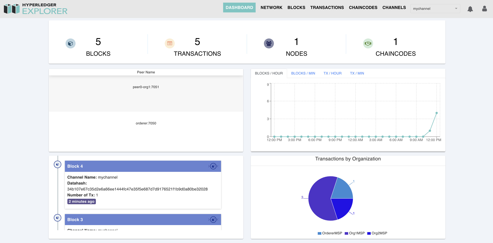

# Hyperledger Fabric POC Network — Kubernetes

 

This repository contains a default Hyperledger Fabric Network and attached components that can be deployed —an example Chaincode, a NodeJS Gateway and a Block Explorer— in order to quickly develop and validate a Proof-of-concept (POC).

The aim of this repository is to provide a set of commands that can define and deploy a network with no hassle.

# Setup

## Dependencies

Some of our scripts make use of the following dependencies. To simplify dependency management it is recommended that you install [Homebrew](http://brew.sh).

* [jq](https://stedolan.github.io/jq/download/) (`brew install jq`)

## Aliases

To simplify some of the commands used below it is recommended that you run the following on your terminal session. They will create aliases that link the script execution to a simple word:

```bash
alias chaincode=./scripts/chaincode
alias explorer=./scripts/explorer
alias gateway=./scripts/gateway
alias network=./scripts/network
```

# Development

This project is made up of two standard Hyperledger Fabric components: Network and Block Explorer and two custom microservices: `gateway` and `chaincode`. These are the components that will incorporate business logic and as such will be modified very often.

As you develop new features you will need to deploy them locally to run tests in your machine's Kubernetes environment. To achieve this you will have to **build** a `local` version and deploy that version to the cluster. The scripts for both of these components allow you to specify what version you want to deploy. The versions that can be deployed are:

* `latest`
* `x.y.z` (semver) (i.e. `1.2.0`)
* `local`

To build your own `local` version with your current changes on either microservice, run

```bash
chaincode build local
```

or

```bash
gateway build local
```

Then specify the `local` version when deploying either service.

If you are already running a service and want to restart it simply run `stop` and then `start`.

# Installation

To install all the components we stagger the deployment in phases. These components will be deployed in a Kubernetes namespace of our choosing. To set this variable, run

```bash
export NAMESPACE=fabric # Replace with desired value
```

and create the namespace by running

```bash
kubectl create ns $NAMESPACE
```

## Hyperledger Fabric Network

To deploy the Hyperledger Fabric network we first need to create all the necessary artifacts —crypto-config, genesis block, `mychannel` configuration block— and copy them to the corresponding PVCs. This is handled when you spin up the platform. To do so run

```bash
network start
```

This will deploy a Hyperledger Fabric network with two organizations, one peer per organization, one peer CLI container per peer and an ordering service. It will also set each organization's only peer as an Anchor peer for Discovery purposes.

## Chaincode as a service

This repository implements a Chaincode management tool to simplify the process of building, packaging, installing, approving, committing and deploying Chaincode as a service.

If you want to deploy the provided Chaincode you will first need to `package` it, `install`, `approve`, and `commit` it to the network.

To do so run the following commands

```bash
# Create a Chaincode .tgz package
chaincode package

# Copy and install the .tgz Chaincode package for org1, org2
chaincode install org1
chaincode install org2

# Approve the Chaincode definition on the channel for org1, org2
chaincode approve org1 mychannel
chaincode approve org2 mychannel

# Commit the Chaincode definition on the channel as org1
chaincode commit org1 mychannel
```

After this process is done we are ready to deploy the Chaincode container on the Kubernetes cluster. To do so run

```bash
chaincode start local # Version can be "latest", "x.y.z (semver)" or "local"
```

## Hyperledger Fabric NodeJS Gateway

An application (Hyperledger Fabric NodeJS Gateway) can interact with a blockchain network by submitting transactions to a ledger or querying ledger content. 

> NOTE: The Hyperledger Fabric NodeJS Gateway service **requires** the Chaincode as a service to be installed, committed, approved and deployed on the network in order to work properly. Check step 2. of this README.

You can specify which version you want to deploy and start the service by running from this root folder

```bash
gateway start local  # Version can be "latest", "x.y.z (semver)" or "local"
```

Once the process finishes you will have to port-forward the pod to access the API. To do so, **open a separate terminal session (and export the NAMESPACE variable again)** and run

```bash
kubectl port-forward deployment/gateway -n $NAMESPACE 4000
```

When the Gateway is up and running you can navigate to http://localhost:4000/docs to see the Swagger UI.

From this webpage you can run the `/invoke` test transaction to initialize the ledger, and then the `/query` test transaction to get all the assets in the ledger.

## Hyperledger Fabric Block Explorer

In addition to the previous components you can also deploy the Hyperledger Fabric Block Explorer, which exposes a UI to gather metrics and insights on the network.

> NOTE: The Hyperledger Fabric Block Explorer **requires** the Chaincode as a service to be installed, committed, approved and deployed on the network in order to work properly. Check step 2. of this README.

To deploy the Hyperledger Fabric Block Explorer run from this root folder

```bash
explorer start
```

Once the process finishes you will have to port-forward the pod to access the UI. To do so, **open a separate terminal session (and export the NAMESPACE variable again)** and run

```bash
kubectl port-forward deployment/explorer -n $NAMESPACE 8080
```

Then from your web browser navigate to http://localhost:8080 and you should see the following UI



> NOTE: This webpage appears to not work on the Safari web browser. Please use Mozilla Firefox or Google Chrome to access it.

# Uninstall

## Uninstall Hyperledger Fabric Block Explorer
To uninstall the Hyperledger Fabric Block Explorer run

```bash
explorer stop
```

## Uninstall Hyperledger Fabric NodeJS Gateway

To uninstall the Hyperledger Fabric NodeJS Gateway service run

```
gateway stop
```

## Uninstall Chaincode as a service

To uninstall the Chaincode as a service run

```bash
chaincode stop
```

## Uninstall Hyperledger Fabric Network

To uninstall the running Hyperledger Fabric Network run

```bash
network stop
```

## Uninstall all at once
To remove all the components of the network run

```bash
kubectl delete ns $NAMESPACE
```